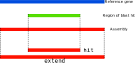
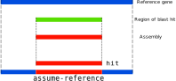

[](https://github.com/Redmar-van-den-Berg/HiFi-assembly/actions/workflows/ci.yml)
[](http://pep.databio.org/en/latest/)


# HiFi assembly
Assemble HiFi reads and extract the specified genes from the assembly.

## Installation
Download the repository from github
```bash
git clone https://github.com/Redmar-van-den-Berg/HiFi-assembly.git
```

Install and activate the
[conda](https://docs.conda.io/en/latest/miniconda.html)
environment.
```bash
conda env create --file environment.yml
conda activate HiFi-assembly
```

## Settings
The settings for this pipeline are defined in a
[PEP](http://pep.databio.org/en/latest/) project file, as shown below.
```yml
pep_version: 2.0.0
sample_table: "samples.csv"
HiFi-assembly:
  # This hifias-flag enables the 'low memory' mode, usefull for testing
  hifiasm-flags:
    - -f0
  reference: tests/data/reference/ASL.fasta
  genes: tests/data/reference/ASL.fasta
```

The samples are defined in a simple CSV file.
```csv
sample_name,bamfile
GM24385,tests/data/GM24385_ASL.bam
```
### Supported settings
The following settings are available for the pipeline, place them under the
`HiFi-assembly` section in the project configuration.
| Option               | Type              | Explanation                             |
| ---------------------| ----------------- | --------------------------------------- |
| reference            | Optional file     | If specified, the contigs will be mapped to the reference |
| genes                | Optional file     | If specified, the genes will be compared to the contigs using BLAST |
| hifiasm-flags        | Optional list     | List of flags to pass to HiFiasm        |
| hifiasm-output       | Optional list     | List of HiFiasm output files to use. Choose any combination of `p_utg`, `p_utg`, `p_ctg`, `a_ctg`, `hap1` or `hap2`, default is `r_utg`. Note that `p_ctg` can contain phase switching |
| hifiasm-write-ec     | Optional boolean  | HiFiasm writes error corrected reads to FASTA. If `reference` is specified, the reads are also mapped to the reference |
| blast-output         | Optional string   | Type of blast output to use, choose from `hit`, `extend` or `assume-reference`. See below for an explanation |

### Multiple bam files per sample
If you have multiple bam files per sample, you can utilise the
`subsample_table` in the PEP project file, see [this
example](https://github.com/Redmar-van-den-Berg/HiFi-assembly/blob/main/tests/pep/project_config_two_bamfiles.yml)
for details. In the `subsample_table`, you can put every input bam file on a
new line, as can be seen
[here](https://github.com/Redmar-van-den-Berg/HiFi-assembly/blob/main/tests/pep/subsample_two_bamfiles.csv).
Be sure to include the sample name for every sample in the
`sample_table` as well (as shown
[here](https://github.com/Redmar-van-den-Berg/HiFi-assembly/blob/main/tests/pep/samples_two_bamfiles.csv)),
otherwise the samples specified in the `subsample_table` will not be included
in the analysis.

## How it works
### Assembly
The reads from the bam file(s) are assembled using `HiFiasm` with default
settings. You can control the behaviour of the assembly using the
`hifiasm-flags` in the project configuration file. This pipeline uses the
haplotype-resolved raw unitig graph from HiFiasm by default, since this graph
contains all haplotype information. This can be changed with the
`hifiasm-output` option, see above. Please carefully read the [HiFiasm
documentation](https://hifiasm.readthedocs.io/en/latest/interpreting-output.html)
on the content of each output file before changing this setting.

The assembly is placed in the `sample/assembly` folder.

### Align contigs to the reference
If a `reference` has been specified in the project configuration file, the
contigs are mapped to the reference using `minimap2`. This allows for visual
inspection of the contigs in IGV. Additionally, unexpected results such as
unmapped contigs, or contigs with large scale deletions can be identified from
the bam file.

The mapped and unmapped bam files are place in the `sample/bamfile` folder.

### Blast genes of interest against the contigs
If a `genes` FASTA file has been specified, these will be blasted against the
contigs to assign them to the corresponding genes.

The full blast results in XML format are placed in
`sample/blast/sample_blast.xml`. Additionally, the section that matches the
sequence in the `genes` FASTA file will be placed in a FASTA file with the
corresponding gene name. For example, if contig `utg000010l` contains the
`CYP2D6` gene, the sequence content of `utg000010l` that matches `CYP2D6` will
be placed in `sample/blast/sample_CYP2D6.fasta`. The fasta header will include
information about the region of the contig that matches, i.e.
`utg000010l:9807-6104 (CYP2D6)`.
**Note: if there are regions in the assembly that overlap a gene, but are not
included in the BLAST hit (i.e. that are too different from the gene), these
will still be included in the fasta file for that gene.**

#### blast-output
After the contigs are blasted against the genes of interest, there are several
ways to parse the resulting hits, which can be specified using the
`blast-output` option.

The following picture shows the situation where the assembly and the gene of
interest are the same length, but are only identical in a small region in the
center.



If `hit` is selected as `blast-output`, only the region from the assembly that
matches the reference gene is included in the output.

If `extend` is selected, the blast hit is extended to the size of the reference
gene (if possible), and this whole region is included in the output.



If `assume-reference` is selected as `blast-output` and the assembly is smaller
than the reference gene, we assume that the missing parts of the assmbly are
identical to the reference gene, and this is included in the output.
In the case where the assembly and the gene of interest
`hit` will only include the region from the contig that is included in the
blast hit, even if both the contig and the gene of interest extend further.
